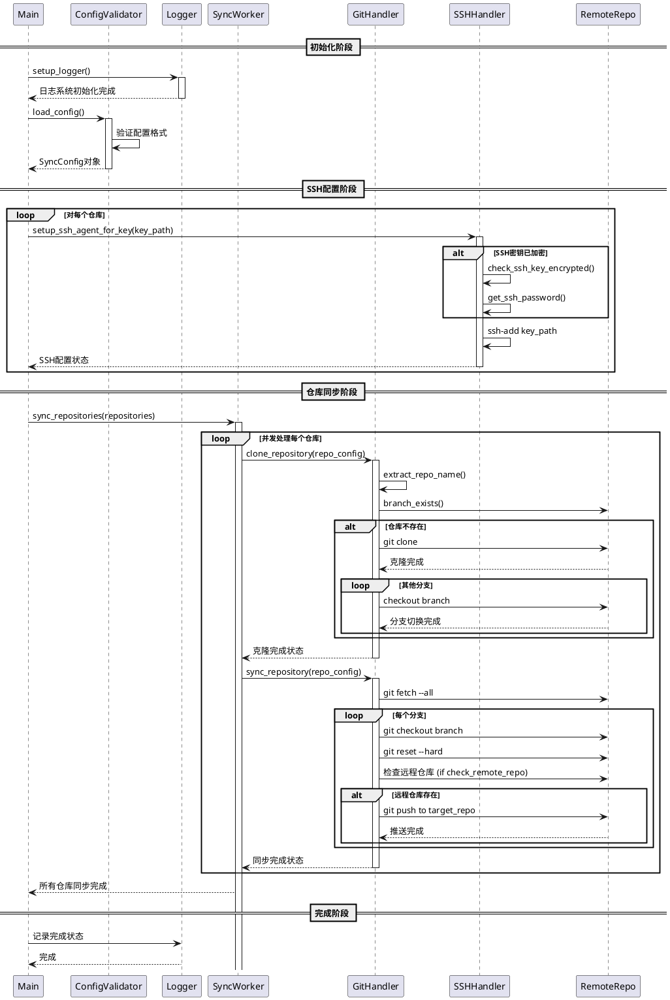

# Introduction
本项目存在的目的是为了同步代码，目前支持git同步方式为 ssh(支持证书有密码)和http(需要账号密码)

推荐ssh方式,不推荐http方式,ssh更安全,支持lfs大文件,侵入低

# TODO
- [x] 单独设置ssh_key_path
- [x] 删掉name字段，采用public_repo的后缀name
- [x] 完善log打印信息
- [x] 支持多仓库同步 
- [x] 拆分一个工具类出来，方便调用，main方法只保留核心代码
- [x] 支持http的模式同步，账号密码写到仓库的信息中
- [x] ssh 和 http穿插使用
- [x] 支持推送前检查远程仓库是否存在
- [x] 支持ssh证书密码设置
- [ ] 支持多线程
- [ ] clone仓库时随机生成一个文件夹名称，作为clone路径，避免出现同名仓库覆盖现有文件的情况


# Requirements
- python3.10 (require)
- git (require) 自行安装
- ssh证书,在每个托管平台都要配置 (require,强烈建议新建证书) `ssh-keygen -t rsa -b 4096 -f ./transfer_rsa_key -C "xxx@qq.com"`
- git-lfs(https://git-lfs.com 存在大文件使用时，需要下载大文件)
- sshpass (使用SSH密钥密码时需要安装)
- 请确保运行的机器能同时访问两个git托管平台
- 请确保ssh有权限读写仓库
- 注意,多仓库同步中,项目名不能有重复，否则会异常!!!!! 未来会增加单独路径的支持
- !!!注意官方的gitlab如果检测仓库不存在的话，会自动创建仓库!!!


# Usage

## 配置文件说明
配置`repo_config.json`文件，下面是完整的配置示例：

```json
{
  "file_path": "/Users/wangjiahao/Downloads/sync-git/", // git clone 文件路径(填写本机的路径)
  "check_remote_repo": true, // 全局配置：是否检查远程仓库存在性,!!!注意官方的gitlab如果检测仓库不存在的话，会自动创建仓库!!!
  "auth_configs": { // 认证配置，按域名区分
    "gitlab.remember5.top": { // 域名（可带端口）
      "type": "http", // 认证类型：http 或 ssh
      "username": "xxx@qq.com", // HTTP认证用户名
      "password": "xxxx", // HTTP认证密码
      "check_remote_repo": true // 覆盖全局配置，针对此域名是否检查远程仓库
    },
    "gitlab.com": {
      "type": "http",
      "username": "xxx@qq.com",
      "password": "xxxx",
      "check_remote_repo": false
    },
    "github.com": {
      "type": "ssh",
      "key_path": "/Users/wangjiahao/Downloads/transfer_rsa_key", // SSH密钥路径
      "password": "", // SSH密钥密码（如有）
      "check_remote_repo": true
    }
  },
  "repositories": [ // 仓库配置列表
    {
      "branches": ["main", "test"], // 要同步的分支列表
      "source_repo": "https://gitlab.remember5.top/wangjiahao/sync-git.git", // 源仓库地址
      "target_repos": [ // 目标仓库地址列表（可多个）
        "https://gitlab.com/wangjiahao0505/git-sync1.git"
      ]
    }
  ]
}
```

## 配置项说明

1. **基本配置**：
   - `file_path`: 仓库克隆的本地目录路径
   - `check_remote_repo`: 全局配置，是否在推送前检查远程仓库是否存在

2. **认证配置** (`auth_configs`)：
   - 按域名配置不同的认证方式
   - 支持HTTP和SSH两种认证方式
   - SSH认证可以配置密钥路径和密钥密码
   - 每个域名可以单独配置是否检查远程仓库存在性，会覆盖全局配置

3. **仓库配置** (`repositories`)：
   - `branches`: 需要同步的分支列表
   - `source_repo`: 源仓库地址
   - `target_repos`: 目标仓库地址列表，可以配置多个

## 运行方式

1. 配置好 `repo_config.json` 文件
2. 运行 `python main.py`

支持加密的ssh证书密码设置，环境变量`SSH_KEY_PASSWORD`设置密码即可


# 注意事项

1. **关于远程仓库检查**：
   - 设置 `check_remote_repo` 为 `true` 可以在推送前检查远程仓库是否存在
   - 可以全局设置，也可以针对特定域名单独设置
   - 如果检查发现仓库不存在，将会跳过该仓库的推送

2. **认证方式选择**：
   - SSH方式更安全，支持大文件，推荐使用
   - 如果使用带密码的SSH密钥，需要安装sshpass工具
   - HTTP方式需要提供用户名和密码，安全性较低

3. **仓库名冲突**：
   - 多仓库同步时，项目名不能重复，否则会出现异常
   - 仓库名是从仓库URL中提取的

4. **权限问题**：
   - 确保SSH密钥在目标平台已配置并有读写权限
   - HTTP方式需要确保用户名密码正确并有读写权限

5. **分支存在性**：
   - 确保配置的分支在源仓库中存在
   - 如果源仓库中不存在某分支，程序会报错

6. **网络访问**：
   - 确保运行程序的机器能够访问所有配置的Git托管平台


# FAQ
### 提示分支不存在
请确认仓库地址的正确性，以及ssh端口是否正确(ssh默认为22)

### 推送失败但未检查远程仓库
检查配置中的 `check_remote_repo` 是否正确设置，可能是域名特定的配置覆盖了全局配置

### HTTP认证失败
确认用户名和密码是否正确，以及是否有仓库的访问权限

### SSH认证失败
确认SSH密钥是否正确配置，路径是否存在，以及是否已在目标平台添加公钥。如果使用密码保护的SSH密钥，确保密码正确，并且已安装sshpass工具。


# Contact Me

- GitHub: https://github.com/remember-5
- Email: [1332661444@qq.com](mailto:1332661444@qq.com)


# 架构图



# 测试

## SSH模式
- [x] 测试ssh无密码方式
- [x] 测试ssh有密码方式
- [ ] 默认证书路径
- [x] 指定证书路径

## HTTP模式
- [x] 测试用户名密码认证
- [x] 测试不同域名不同认证方式

## 远程仓库检查
- [x] 全局启用远程仓库检查
- [x] 特定域名启用/禁用远程仓库检查
- [x] 远程仓库不存在时的行为

## 其他
- [x] 1个仓库同步到多个仓库
- [x] 远程仓库不存在的情况
